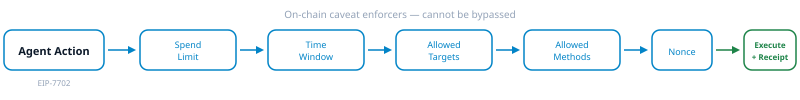
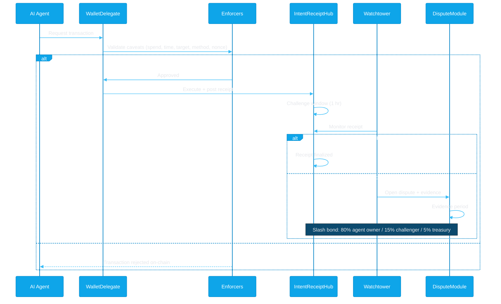
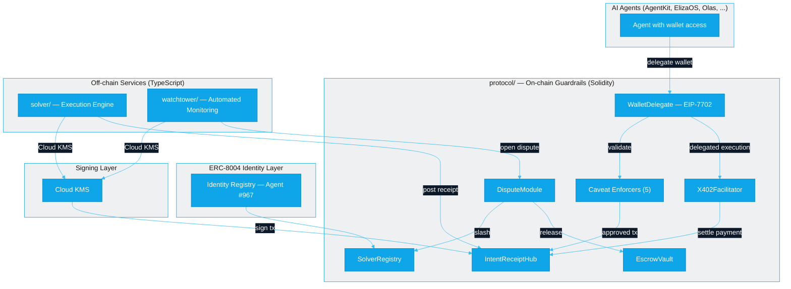
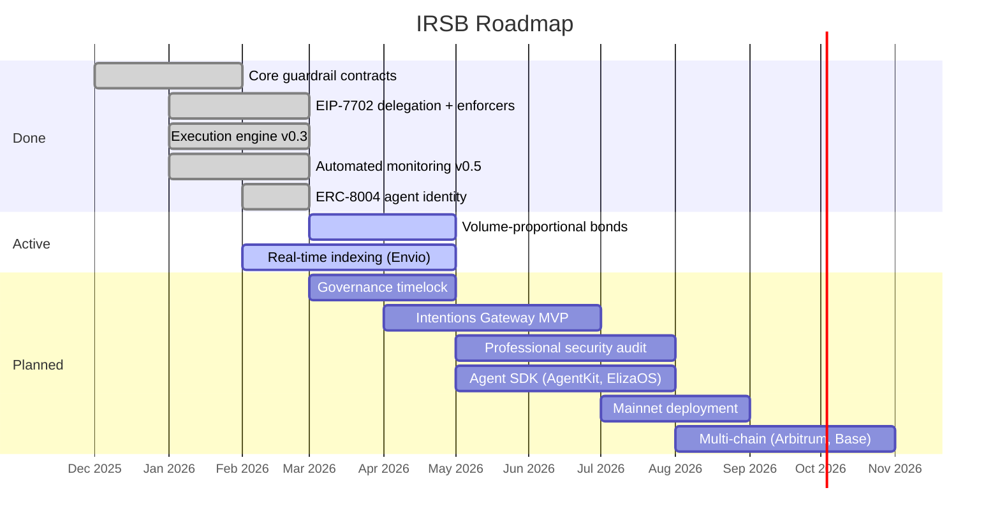

<p align="center">
  <picture>
    <source media="(prefers-color-scheme: dark)" srcset="assets/irsb-banner-dark.svg">
    
  </picture>
</p>

<p align="center">
  <a href="https://github.com/jeremylongshore/irsb/actions/workflows/ci-protocol.yml"></a>
  <a href="https://github.com/jeremylongshore/irsb/actions/workflows/ci-typescript.yml"></a>
  <a href="https://github.com/jeremylongshore/irsb/actions/workflows/ci-agents.yml"></a>
  <a href="https://github.com/jeremylongshore/irsb/actions/workflows/codeql.yml"></a>
<a href="https://ko-fi.com/U5S225PTME"></a>
</p>

<p align="center">
  <a href="https://github.com/jeremylongshore/irsb/blob/main/LICENSE"></a>
  
  
  
  
  
</p>

<p align="center">
  <picture>
    <source media="(prefers-color-scheme: dark)" srcset="assets/stats-dark.svg">
    
  </picture>
</p>

---

## The Problem

AI agents are executing on-chain transactions at increasing scale. Every major framework — AgentKit, ElizaOS, Olas, Virtuals, Brian AI — gives agents wallet access. None of them answer a fundamental question: **what happens when the agent overspends, calls the wrong contract, or acts outside its mandate?**

Today, the answer is: nothing. The agent holds the keys, and the owner trusts that it behaves correctly. Agent wallets face the same attack surfaces as any EOA — prompt injection, key compromise, logic bugs — but agents operate autonomously. A compromised agent can drain funds before a human notices.

## The Gap

| Framework | Spend Limits | Execution Receipts | Automated Monitoring | Dispute Resolution |
|-----------|-------------|-------------------|---------------------|-------------------|
| **AgentKit** | None | None | None | None |
| **ElizaOS** | None | None | None | None |
| **Olas** | Consensus-based | None | None | None |
| **Virtuals** | None | None | None | None |
| **Brian AI** | Aggregator-level | None | None | None |
| **Safe** | Module-dependent | None | None | None |
| **IRSB** | **On-chain enforcers** | **Cryptographic** | **Watchtower** | **On-chain arbitration** |

## Three Layers

**1. Policy Enforcement** — An agent's EOA delegates to a WalletDelegate smart contract via EIP-7702. Every transaction passes through five on-chain caveat enforcers before execution. They cannot be bypassed by the agent, its framework, or a compromised prompt.

**2. Execution Receipts** — Every successful agent action produces a cryptographic receipt: what it intended, what happened, supporting evidence, and a signature proof. V2 adds dual attestation with agent + client EIP-712 co-signatures.

**3. Automated Monitoring** — The watchtower scans receipts against a configurable rule engine. Violations auto-file disputes on-chain. Deterministic cases (timeout, wrong amount) resolve automatically. Complex cases escalate with counter-bonds.

## On-Chain Enforcers

<p align="center">
  <picture>
    <source media="(prefers-color-scheme: dark)" srcset="assets/enforcer-pipeline-dark.svg">
    
  </picture>
</p>

| Enforcer | What It Does | Example |
|----------|-------------|---------|
| **SpendLimitEnforcer** | Daily and per-transaction spending caps | 0.1 ETH/day, 0.01 ETH/tx |
| **TimeWindowEnforcer** | Restrict actions to defined time windows | 09:00-17:00 UTC only |
| **AllowedTargetsEnforcer** | Whitelist of approved contract addresses | Uniswap V3 Router only |
| **AllowedMethodsEnforcer** | Whitelist of approved function selectors | `swap()` yes, `approve()` no |
| **NonceEnforcer** | Replay prevention for each delegated action | One nonce per action |

```solidity
// Agent tries to spend more than allowed — rejected at EVM level
if (spendAmount > perTxCap) revert CaveatViolation("Per-transaction spend limit exceeded");
if (newTotal > dailyCap) revert CaveatViolation("Daily spend limit exceeded");
```

```solidity
// Give an agent a wallet with a 1 ETH daily cap, 0.1 ETH per-tx limit
delegation.caveats[0] = Caveat({
    enforcer: address(spendLimitEnforcer),
    terms: abi.encode(address(0), 1 ether, 0.1 ether)
});
```

## How It Works



## Architecture



## Code Examples

**Execution receipt — cryptographic proof of what the agent did:**

```solidity
struct IntentReceipt {
    bytes32 intentHash;       // what the agent intended
    bytes32 constraintsHash;  // constraints it operated under
    bytes32 routeHash;        // execution route taken
    bytes32 outcomeHash;      // what actually happened
    bytes32 evidenceHash;     // supporting evidence (IPFS/Arweave)
    uint64  createdAt;        // timestamp
    uint64  expiry;           // settlement deadline
    bytes32 solverId;         // who executed it
    bytes   solverSig;        // cryptographic proof
}
```

## Monorepo Structure

```
irsb/
├── protocol/             # Solidity contracts — Foundry (v1.4.0, 552 tests)
│   ├── src/              # 37 contracts (enforcers, delegation, receipts, disputes)
│   ├── test/             # Foundry tests + CI fuzz (10k runs)
│   ├── sdk/              # TypeScript SDK (@irsb/sdk)
│   └── packages/         # x402-irsb integration
├── services/
│   ├── solver/           # Execution engine — TypeScript, Express (v0.3.0)
│   ├── watchtower/       # Automated monitoring — TypeScript, Fastify (v0.5.0)
│   ├── agents/           # AI agents — Python, FastAPI, LangChain (v0.2.0)
│   └── gateway/          # Intentions Gateway (planned)
├── packages/
│   ├── kms-signer/       # Shared Cloud KMS signing (@irsb/kms-signer)
│   └── types/            # Shared types & addresses (@irsb/types)
└── 000-docs/             # Architecture decisions & research
```

## Live on Sepolia

| Contract | Address |
|----------|---------|
| **WalletDelegate** | [`0x6e7262bA8eE3e722aD5f83Ad793f3c071A3769cB`](https://sepolia.etherscan.io/address/0x6e7262bA8eE3e722aD5f83Ad793f3c071A3769cB) |
| **IntentReceiptHub** | [`0xD66A1e880AA3939CA066a9EA1dD37ad3d01D977c`](https://sepolia.etherscan.io/address/0xD66A1e880AA3939CA066a9EA1dD37ad3d01D977c) |
| **DisputeModule** | [`0x144DfEcB57B08471e2A75E78fc0d2A74A89DB79D`](https://sepolia.etherscan.io/address/0x144DfEcB57B08471e2A75E78fc0d2A74A89DB79D) |
| **SolverRegistry** | [`0xB6ab964832808E49635fF82D1996D6a888ecB745`](https://sepolia.etherscan.io/address/0xB6ab964832808E49635fF82D1996D6a888ecB745) |
| **ERC-8004 Agent** | ID `967` on [`IdentityRegistry`](https://sepolia.etherscan.io/address/0x8004A818BFB912233c491871b3d84c89A494BD9e) |

<details>
<summary><strong>All deployed contracts</strong></summary>

| Contract | Address |
|----------|---------|
| X402Facilitator | [`0x0CDf48B293cdee132918cFb3a976aA6da59f4E6F`](https://sepolia.etherscan.io/address/0x0CDf48B293cdee132918cFb3a976aA6da59f4E6F) |
| EscrowVault | deployed with DisputeModule |
| SpendLimitEnforcer | [`0x8eBAF3db4785C3E8DFABa1A77Ee6373eD5D38F8D`](https://sepolia.etherscan.io/address/0x8eBAF3db4785C3E8DFABa1A77Ee6373eD5D38F8D) |
| TimeWindowEnforcer | [`0x51DF412e99E9066B1B3Cab81a1756239659207B4`](https://sepolia.etherscan.io/address/0x51DF412e99E9066B1B3Cab81a1756239659207B4) |
| AllowedTargetsEnforcer | [`0x80a18b93014E0a2A3Af025C7Fa2213E24e9E2A2b`](https://sepolia.etherscan.io/address/0x80a18b93014E0a2A3Af025C7Fa2213E24e9E2A2b) |
| AllowedMethodsEnforcer | [`0x633aC1d114e18d1F1fC1De30a6aF37fe1AE91ddf`](https://sepolia.etherscan.io/address/0x633aC1d114e18d1F1fC1De30a6aF37fe1AE91ddf) |
| NonceEnforcer | [`0x02962c406A7a29adF26F40657b111B90c236DbF1`](https://sepolia.etherscan.io/address/0x02962c406A7a29adF26F40657b111B90c236DbF1) |

</details>

## Security & Research

All stateful contracts implement ReentrancyGuard, Pausable, Ownable, and EIP-712 typed signatures. Transaction signing uses Google Cloud KMS — no private keys in code or environment variables. Contract ownership is held by a 2/3 Safe multisig, not a single EOA.

**552 Foundry tests** with CI fuzz (10,000 runs per fuzz target). Automated scan by SolidityGuard v1.2.0 found 0 actionable critical findings across 37 files / 6,976 lines. **No formal third-party audit yet** — planned before mainnet deployment. Testnet only.

<details>
<summary><strong>Defense patterns</strong></summary>

| Pattern | Coverage |
|---------|----------|
| ReentrancyGuard | All 10 stateful contracts |
| Pausable | 8 contracts |
| Ownable | All contracts |
| EIP-712 Typed Signatures | Receipts + delegations |
| Pull-over-Push | Bond withdrawals, escrow releases |
| Custom Modifiers | `receiptExists`, `solverExists`, `escrowExists` |

</details>

<details>
<summary><strong>Research highlights</strong></summary>

| Topic | Status | Docs |
|-------|--------|------|
| AI agent framework landscape | Competitive analysis | [032-MK-PITC](protocol/000-docs/032-MK-PITC-eip7702-for-ai-agents.md), [033-MK-TARG](protocol/000-docs/033-MK-TARG-agent-framework-targets.md) |
| Intentions Gateway (Web2+Web3 policy) | Architecture approved | [040-AT-ARCH](protocol/000-docs/040-AT-ARCH-intentions-gateway-architecture.md) |
| Blockchain indexer evaluation (Envio) | Evaluating | [042-AT-RSCH](protocol/000-docs/042-AT-RSCH-envio-hyperindex-research.md), [043-MR-RSCH](protocol/000-docs/043-MR-RSCH-indexer-adoption-analysis.md) |
| Volume-proportional bonds | Pre-mainnet blocker | [Pre-mortem PM-EC-001](protocol/000-docs/039-AA-AUDT-pre-mortem-analysis.md) |
| Governance timelock | Pre-mainnet blocker | [Pre-mortem PM-GV-001](protocol/000-docs/039-AA-AUDT-pre-mortem-analysis.md) |

</details>

## Roadmap



## Getting Started

```bash
# Clone the monorepo
git clone https://github.com/jeremylongshore/irsb.git && cd irsb

# Install all TypeScript dependencies
pnpm install

# Build & test the protocol (requires Foundry)
cd protocol && forge build && forge test && cd ..

# Build & test all TypeScript services
pnpm -r build && pnpm -r test

# Test AI agents (Python)
cd services/agents && pip install -e ".[dev]" && pytest
```

<details>
<summary><strong>Protocol parameters</strong></summary>

| Parameter | Value |
|-----------|-------|
| Minimum Bond | 0.1 ETH |
| Challenge Window | 1 hour |
| Withdrawal Cooldown | 7 days |
| Max Jails (permanent ban) | 3 strikes |
| Counter-Bond Window | 24 hours |
| Arbitration Timeout | 7 days |
| Slash Distribution | 80% user / 15% challenger / 5% treasury |

</details>

<details>
<summary><strong>Standards</strong></summary>

| Standard | Role in IRSB |
|----------|-------------|
| [ERC-7683](https://eips.ethereum.org/EIPS/eip-7683) | Cross-chain intent format — receipts reference ERC-7683 intent hashes |
| [EIP-7702](https://eips.ethereum.org/EIPS/eip-7702) | EOA delegation — agents delegate to WalletDelegate for policy enforcement |
| [ERC-7710](https://eips.ethereum.org/EIPS/eip-7710) | Delegation redemption — `redeemDelegations()` for smart contract execution |
| [ERC-7715](https://eips.ethereum.org/EIPS/eip-7715) | Permission requests — `wallet_requestExecutionPermissions` for dapp UX |
| [ERC-8004](https://eips.ethereum.org/EIPS/eip-8004) | Agent identity — on-chain reputation signals via the identity registry |
| [x402](https://www.x402.org/) | HTTP payment protocol — IRSB solver serves as x402-compatible payment facilitator |

</details>

## Documentation

- [AI-CONTEXT.md](./AI-CONTEXT.md) — Full ecosystem reference (contracts, concepts, glossary)
- [000-docs/](./000-docs/) — Architecture decisions, research, and planning

## License

[BUSL-1.1](./LICENSE) — Source-available. Free for non-production use, integration into your own apps, testing, and research. Cannot be repackaged as a competing commercial service. Converts to MIT on 2029-02-17.
